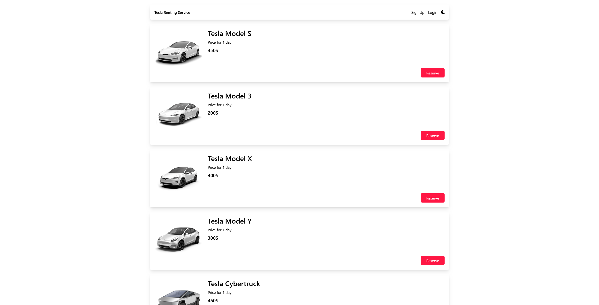

# tesla-renting



- [tesla-renting](#tesla-renting)
  - [Description](#description)
  - [Goal of the project](#goal-of-the-project)
  - [Decisions and thought process](#decisions-and-thought-process)
  - [Technologies](#technologies)
    - [Frontend](#frontend)
      - [NPM modules:](#npm-modules)
    - [Backend](#backend)
  - [Installation and Setup Instructions](#installation-and-setup-instructions)
  - [Credits](#credits)
## Description
Tesla Renting is a fullstack application built for Happy Team's recruitment task.  

## Goal of the project
Your client has asked you to create a web app for **renting Tesla cars in Mallorca**. They have a few locations (Palma Airport, Palma City Center, Alcudia and Manacor) and people can rent and return the cars at any one of them. They rent all available passenger Tesla models (except the Semi). They will give you exact pricing later; for now, you should use amounts of your choosing. The website should allow you to create a reservation for a Tesla for a specified date range. It should also calculate the total cost of the reservation and store the reservation details in some database.

## Decisions and thought process
At the beginning, I'd like to say that I did not give myself enough time for this project. I admit to my mistake. I didn't manage to finish the project, but I did what I could. My frontend is able to send reservation data to backend and my backend is able to print it, but I did not have time to implement backend data validation and logic for inserting the data into my database. It's the same reason why I decided to delete code related to users and registration/authentication. 

If I had more time, I'd focus on validating received reservation data and adding it to the database.

## Technologies
### Frontend
Frontend part of this application is built using **React.js**, **TypeScript** and **Tailwind CSS**. It is bundled and served using **Vite**.
#### NPM modules:
- **rect-router-dom**: Used for routing within the application
- **react-hook-form**: Used for managing form state and validation
- **validator**: Used for string validation
- **zod**: Used for schema validation
### Backend
- **ASP\.NET Web API**: Used to create RESTful API for the frontend to interact with
- **Entity framework**: Used for data access and interactions with the database
- **MySQL**: Used as the primary database for storing and managing application data.

## Installation and Setup Instructions
1. **Clone the repository**
   ```bash
   git clone https://github.com/asuujx/tesla-rental.git
   ```
2. **Install frontend dependencies**
   ```bash
   cd tesla-rental/frontend
   npm install
   ```
3. **Setup the database**
   Database file (**tesla_renting.sql**) is in project's root folder. It has to be imported to a SQL server (MySQL Workbench for example). Code related to database connection is places inside **appsettings.json** file in the backend folder.
4. **Start the servers**
   ```bash
   npm run dev
   dotnet run
   ```
5. Open browser and type http://localhost:3007/ into the URL.

## Credits
- The images of the car models were sourced directly from their respective manuals